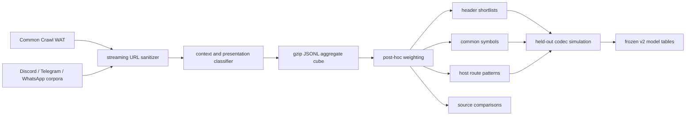

# v2 training and model-selection design

Status: **implemented pipeline and trained draft v2 model**.

The streaming trainer, reweightable aggregate cube, report generator, residual-token trainer, and runtime v2 codec described here exist in the repository. The generated tables are still a compatibility draft; `/1/` remains the unchanged v1 decoder exception.

## Objective

v1 learned broadly useful URL tokens from a comparatively undifferentiated URL corpus. v2 instead tries to minimize the expected visible length of URLs that people are likely to submit to a URL compressor.

Those are not the same distribution. A link exposed in a Reddit post, Discord message, or social profile is more relevant than a masked navigation link found deep in a generated site. Raw crawl frequency alone also overvalues crawlers, redirectors, media CDNs, and large sites whose links are rarely shortened manually.

The v2 objective is therefore:

> Choose header symbols and body tokens that maximize expected encoded-character savings under an explicit, editable model of datasets, discovery contexts, and link presentation.

The expensive corpus scan preserves raw, high-dimensional counts. Opinions about the desired distribution are applied later, so changing a weight does not require rereading hundreds of gigabytes of archives.

## Pipeline



The archive readers are streaming. Compressed WAT, tar, zstd, gzip, ZIP, XML, JSON, and TSV inputs are decoded in place; the trainer does not extract or write sanitized sibling datasets.

## Input corpora

### Common Crawl WAT

WAT records provide both the destination and useful discovery metadata:

- source page URL and host;
- anchor target and displayed text;
- page title and link structure;
- enough platform context to recognize some social posts, profiles, forums, video pages, directories, and internal navigation.

The current full run uses roughly 200 GiB of spaced shards from `CC-MAIN-2026-30`. Spacing shards across the crawl reduces the locality bias that comes from taking one contiguous range. Common Crawl remains broad web evidence; it is not treated as a direct proxy for URLs people paste into chat.

WAT links are deduplicated per source page and capped at three links to one target registrable domain per page. This prevents a large navigation block from multiplying one site hundreds of times on every page.

### Messaging datasets

The messaging reader currently supports:

| dataset | format | role |
| --- | --- | --- |
| Discord Unveiled | zstd-compressed tar containing JSONL | large public Discord message sample |
| DISCO | ZIP containing XML | Discord conversation sample |
| Telegram Group-verse sample | ZIP containing JSON | Telegram messages, entities, and forwarding state |
| TGDataset | gzip-compressed tar containing JSON | Telegram corpus; the public release deliberately excludes links, so it contributes little direct destination evidence |
| WhatsApp public groups | TSV | public-group media/link records |

These sources better approximate visible links in messaging, but they have their own demographic, language, community, moderation, and collection biases. Dataset identity is preserved so those biases can be reweighted instead of being silently blended.

See [messaging-link-sharing-datasets.md](research/messaging-link-sharing-datasets.md) for provenance, licenses, checksums, and acquisition caveats.

## Streaming sanitization

The sanitizer emits `TrainingUrl` observations, not cleaned messages.

### Parallel and resumable messaging scans

Messaging input parallelism lives above the format adapters. `scripts/run-messaging-shards.ts` discovers the same supported archive types as the Rust reader and runs independent archives concurrently. The deep module interface is one archive in, one immutable aggregate shard out; callers do not manage decompression, format recovery, URL sanitation, artifact validation, or retry state.

Every shard directory contains:

- `cube.jsonl.gz` for post-hoc weighting and deterministic multi-cube merging;
- `heldout.jsonl.gz` with URL-only examples and coarse context;
- `header-stats.json` and `report.md`;
- stdout/stderr logs;
- `complete.json`, written atomically only after all required artifacts exist.

The root `manifest.json` records pending, running, complete, and failed shards plus the stable ordered list of reusable cube paths. Resume compares a fingerprint of the input path/size/mtime, trainer binary, public suffix list, and scan options. A crash can leave partial artifacts but cannot create a completion marker, so the next invocation reruns only that archive. One failed adapter is reported while the remaining shards continue.

The coordinator parallelizes independent `.tar.gz`, `.zip`, and `.zst` files. It does not claim that one gzip stream can be split: DEFLATE state makes a single archive sequential without an external block index or repacking. The default is two concurrent archives with two downstream statistics workers each to avoid multiplying the trainer's large counter memory fourfold.

It performs the following operations while reading:

1. Accept only absolute `http://` and `https://` destinations.
2. Normalize the hostname and resolve its public suffix and registrable domain.
3. Extract visible URLs and platform-provided URL entities.
4. Unwrap recognized redirect shims without making network requests.
5. Deduplicate destinations within one source message or page.
6. Drop bot-authored Discord messages unless explicitly enabled.
7. Drop known URL shorteners because encoding an already-short opaque redirect is not useful training evidence.
8. Drop common GIF and embedded-image providers by default because those platforms normally render the media itself.
9. Classify the surviving observation by dataset, source context, and presentation.

Known redirect handling includes YouTube, Facebook/Messenger/Instagram, Google, LinkedIn, Reddit outbound links, Steam, Discord, Slack, Medium, Tumblr's `href.li`, and Twitter/X display URLs when the destination is exposed in page metadata. Opaque services such as `t.co` cannot be reversed when the corpus contains only the redirect URL.

Malformed input is isolated at the narrowest safely resumable scope:

- malformed JSONL or TSV rows are counted and skipped;
- malformed monolithic JSON or XML members retain any observations already emitted from their valid prefix, then the reader continues with the next archive member;
- unreadable or corrupt archives are counted and skipped before continuing with the next corpus input;
- output failures remain fatal because continuing cannot produce a trustworthy artifact.

Failures are reported with dataset, input path, optional archive member, scope, stage, and a bounded parser error. Message contents are not written to logs, and retained failure details are capped to prevent hostile input from consuming unbounded memory.

## Privacy boundary

The durable training cube contains aggregate counters. It does not contain message text, usernames, channel identifiers, or a URL dump.

Held-out samples are separate and more sensitive. They may preserve a target URL plus source URL, source host, displayed text, and link href so classification and codec savings can be audited. Held-out files should remain local, have a bounded sample size, and never be published without a separate privacy review.

The intended lifecycle is:

- source archives remain on private storage;
- the trainer streams them without extraction;
- aggregate cubes are retained for future reweighting;
- held-out samples are access-restricted and disposable;
- generated aggregate reports may be shared after checking low-count entries.

## Signal model

Every retained count is indexed by both dataset and context. Dataset names also belong to a broader family such as `commoncrawl`, `discord`, `telegram`, or `whatsapp`.

### Discovery context

| context | default class weight | interpretation |
| --- | ---: | --- |
| `internal` | 1 | link stays on the same site |
| `directory-external` | 2 | external directory or index entry |
| `web` | 4 | generic external web link |
| `blog-news` | 8 | editorial or article context |
| `forum`, `video` | 12 | forum or video-page context |
| `forwarded-message` | 16 | forwarded messaging content |
| `forum-post` | 20 | user-authored forum post |
| `social-profile` | 24 | profile or bio link |
| `social-post` | 32 | user-authored social post |
| `message` | 40 | direct public-message observation |

The values are modeling choices, not measured probabilities. Their purpose is to expand the dynamic range between high-value human-sharing evidence and generic crawl noise.

### Link presentation

| presentation | multiplier | interpretation |
| --- | ---: | --- |
| `visible-url` | 1 | displayed text is the destination URL |
| `redirected-url` | 1 | a visible destination was recovered from a platform redirect |
| `submitted-url` | 2 | platform structure identifies the user-submitted target even though a titled card masks it |
| `masked` | 0 | ordinary anchor text hides the destination |
| `missing-text` | 0 | no useful display text is available |

Masked and missing-text observations remain in raw counters even though their default score is zero. This makes the choice reversible.

### Effective weight

For dataset `d`, family `f(d)`, and context/presentation cell `c`, the report pass uses:

```text
effectiveWeight(d, c)
  = familyWeight[f(d)]
  * datasetWeight[d]
  * contextWeight[c]
```

For an aggregate key `k`:

```text
weightedCount(k)
  = sum over d,c of rawCount(k, d, c) * effectiveWeight(d, c)
```

Family and dataset weights correct corpus-level bias. Context weights express how likely a discovered link is to resemble something submitted to piss.zip.

The current full-run configuration is:

```text
family:  commoncrawl=1, discord=4, telegram=5, whatsapp=6
dataset: disco=0.75, telegram-groupverse=1.25
context: social-post/visible-url=32
         message/visible-url=40
         forwarded-message/visible-url=16
```

Unspecified cells use the defaults embedded in cube metadata.

## Aggregate cube

`--raw-stats` writes gzip-compressed JSONL. The first row declares ordered dataset and context dimensions. Later rows store sparse `[signalIndex, rawCount]` pairs.

The important row types are:

| row type | use |
| --- | --- |
| `totals` | corpus and signal denominators |
| `scheme` | HTTP versus HTTPS frequency |
| `tld`, `suffix` | TLD/public-suffix header candidates |
| `host` | exact registrable-host header candidates |
| `source` | “links found on” evidence |
| `character` | frequency evidence for internal literal-token code ranking; never changes a mode's fixed carrier/radix alphabet |
| `path-segment`, `query-key`, `term` | general body-token candidates |
| `host-pattern` | host-conditioned path/query structures |
| `length` | URL-length distribution |

Counts remain raw. The cube schema and invariants are specified in [training-cube-schema.md](training-cube-schema.md).

String counters are bounded to keep memory finite. When a counter grows beyond its configured limit, low-value keys may be pruned; counts for retained keys remain exact. The pruning threshold and candidate limit must therefore be recorded with any frozen model.

## Host-conditioned route patterns

Global token frequency alone misses structures that are nearly universal on one host:

- `youtube.com/watch?v=`;
- `x.com/<user>/status/<id>`;
- `wikipedia.org/wiki/`;
- `reddit.com/r/<subreddit>/comments/<id>`.

The trainer records host-pattern observations for:

- one-, two-, and three-segment path prefixes and sequences;
- individual path segments;
- first, later, and position-independent query keys;
- path/query prefix boundaries such as `/watch?v=`;
- suffix-boundary patterns.

Each pattern is counted at most once per URL. The separate host count supplies a denominator, allowing reports to show raw coverage and a 95% Wilson lower bound rather than trusting tiny samples with apparent 100% coverage.

The report compares at least two strategies:

1. a host symbol plus reusable body tokens, such as `youtube.com` and `/watch?v=`;
2. a combined host-route token, such as `youtube.com/watch?v=`.

Combined tokens are only compelling when their additional coverage-adjusted saving beats keeping the tail reusable across hosts.

## Header shortlist scoring

Hosts and suffixes share one candidate namespace. A selected exact host already implies its suffix, so a header never needs both `.com` and `youtube.com` for the same URL.

For candidate `k`:

```text
removedCharacters(host)   = length("youtube.com")
removedCharacters(suffix) = length(".com")

gain(k, headerLength)
  = weightedCount(k)
  * max(0, removedCharacters(k) - (headerLength - 1))
```

All v2 URLs already pay for one structural header character. A two-character candidate therefore pays one additional character, and a three-character candidate pays two. This naturally favors long hosts when two candidates have similar weighted use, while still allowing an extremely frequent short suffix to win.

The lead-range optimizer evaluates how much of the first-character alphabet should announce one-, two-, or three-character headers. Capacities and decoder behavior are described in [v2-header-format.md](v2-header-format.md).

The additive estimate is a shortlist search, not the final codec benchmark. A URL may match both a suffix and a host candidate, body tokens interact with header removal, and radix packing crosses visible-character boundaries. Final selection must be rerun over held-out URLs through the real candidate codec.

## Residual payload training

The final payload model must be trained after simulating the frozen header tables. Training on untouched URLs would relearn host and suffix strings already removed by the header and would mismeasure route coverage.

For each URL and output mode, residual training:

1. enumerate the same raw, suffix, and exact-host candidates as the runtime encoder;
2. remove the selected scheme, `www.`, host/suffix, and recognized final basename;
3. retain the selected header identity beside the residual body;
4. emit universal term, structured-run, and header-conditioned pattern counts with the existing dataset/context dimensions;
5. retain deterministic held-out residual URLs for actual codec simulation.

The tokenizer interface receives the v2 carrier mode and `{ kind, value }` header selection, so a generated model can distinguish universal tokens from grammars conditioned on `youtube.com`, `x.com`, `wikipedia.org`, `reddit.com`, or any later selected header without leaking that decision into ordinary codec callers.

`pnpm train:tokenizer` selects 44 redundancy-aware universal residual terms, up to 64 header-selected hosts, and up to eight routes per host. Calibration tails identify fixed decimal, hexadecimal, base64url, and lower-hyphen suffix shapes only when at least 80% of five or more observations agree. The generated runtime model contains ten direct dictionary symbols, 34 extended entries, host-conditioned route tables, and one canonical length-limited Huffman table per carrier mode. The four carrier alphabets remain fixed codec inputs.

Huffman training uses exact token costs rather than merely reordering symbols. It tokenizes and selects headers, measures the resulting weighted symbol stream, constructs an optimal complete prefix code with a ten-bit maximum, then repeats with the new costs until every mode stabilizes. The current run converges in four iterations. Encoder and decoder store only the canonical code lengths in the frozen model; individual URLs contain no tree description.

Held-out URLs are deterministically partitioned by target URL and dataset: hash buckets 0–69 calibrate route shapes and Huffman lengths, 70–84 are reserved for model validation, and 85–99 form the evaluation set. This prevents direct structured-suffix inference or code-length fitting on evaluation records. The aggregate cubes were produced before this partition and contain corpus-wide counts, however, so this is token-level isolation rather than a fully corpus-isolated or out-of-distribution benchmark. A final freeze still needs different crawl shards or time-separated corpora.

`pnpm train:tokenizer:benchmark` runs the real v1 and v2 codecs on evaluation buckets 85–99 with report dataset/context weights. The current 2,461 non-zero-weight URLs report average complete-short-URL reductions of 11.58% for ASCII, 13.31% for ASCII+fragment, 12.26% for CJK, and 14.80% for CJK+fragment. Against the prior fixed 5/6/7-bit tiered symbol code, Huffman alone saves 1.545, 1.555, 0.575, and 0.575 characters respectively. The machine-readable result is `tokenizer-benchmark.json`; the compact table is `tokenizer-benchmark.md`.

## Reports

`pnpm train:reports` invokes the Rust trainer's bounded streaming `report` mode and writes:

- `report-manifest.json`: input cubes, dimensions, and all effective weights;
- `header-shortlists.json` and `.md`: independent lead-allocation searches for all four output modes;
- `common-symbols.json` and `.md`: literal-character and shared dictionary candidates;
- `host-patterns.json` and `.md`: per-host path/query coverage and token alternatives;
- `source-comparison.json` and `.md`: Common Crawl, Discord, Telegram, WhatsApp, and individual dataset comparisons.
- `hosts.jsonl`: every observed host with aggregate raw and weighted counts only, intentionally omitting dataset/context splits.
- `tokenizer-model.json`: selected residual dictionaries and header-conditioned routes, including learned fixed suffix shapes.
- `tokenizer-benchmark.json` and `.md`: weighted held-out v1/v2 comparisons for all four carrier modes.

Markdown is deliberately capped for humans. JSON contains complete evaluated shortlists. The aggregate cube remains the source of truth when a report cap is insufficient.

## Running and reweighting

The end-to-end runner builds the Rust trainer, scans both corpus families, and generates reports:

```powershell
pwsh scripts/run-full-training.ps1
```

If Common Crawl completed but messaging failed, reuse the completed Common Crawl cube:

```powershell
pwsh scripts/run-full-training.ps1 -SkipCommonCrawl
```

To regenerate reports with new weights and no corpus scan:

```powershell
pnpm train:reports -- `
  --cubes "data/training/full-2026-08-16/commoncrawl-cube.jsonl.gz,data/training/full-2026-08-16/messaging-cube.jsonl.gz" `
  --out-dir data/training/full-2026-08-16/reports `
  --family-weights "commoncrawl=1,discord=4,telegram=5,whatsapp=6" `
  --dataset-weights "disco=0.75,telegram-groupverse=1.25" `
  --context-weights "social-post/visible-url=32,message/visible-url=40,forwarded-message/visible-url=16"
```

## Reproducibility requirements

A frozen v2 model should record:

- corpus release identifiers and exact shard list;
- source archive hashes where available;
- public suffix list revision;
- trainer/report-generator commit;
- cube schema version and counter limits;
- sanitizer exclusion lists;
- all family, dataset, context, and presentation weights;
- header candidate and curve limits;
- random or deterministic held-out sampling parameters;
- generated table hash;
- held-out compression results for every output mode.

Generated encoder tables and decoder tables must be committed together. A table reorder is a wire-format change even when the set of strings is unchanged.

`pnpm train:codec:model` performs this freeze step for the current draft. It removes report-only dimensions, canonicalizes the fixed `.com`/`.net`/`.org` order, deduplicates identical mode arrays, includes the top 44 header-aware payload terms, and embeds a SHA-256 content hash.

## Known gaps before freezing v2

The current reports are suitable for exploration, not yet for declaring the optimal production model.

1. The multi-cube shortlist generator computes the correct per-tier gain but currently starts from a frequency-ordered candidate pool. The final allocator must rank or optimize using tier-specific marginal gain so long hosts receive their intended advantage.
2. The older single-corpus optimizer supports a configurable `0.85` ccTLD multiplier. That penalty has not yet been ported into the multi-cube report pass.
3. The held-out codec benchmark is now implemented and passing, but table allocation and tokenizer entries have not yet been jointly re-optimized as one combinatorial objective.
4. Corpus representativeness remains the largest uncertainty. Public messaging datasets are useful but are not a substitute for consented, privacy-preserving aggregate evidence from real shortening behavior.
5. The variable-length header and generated tables are implemented as a draft; browser/Cloudflare transport validation and an explicit compatibility freeze are still required before deployment.

These are intentionally documented as model-selection tasks, not hidden assumptions.
